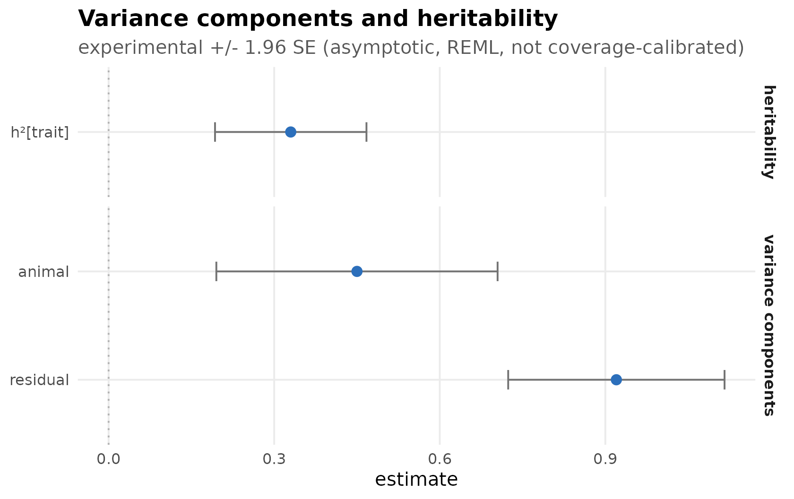
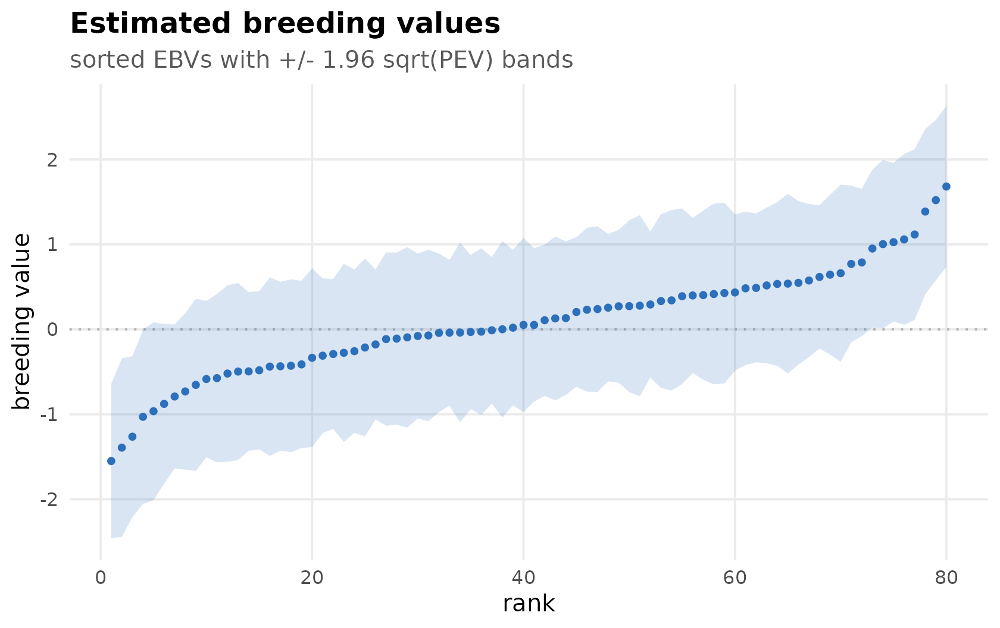
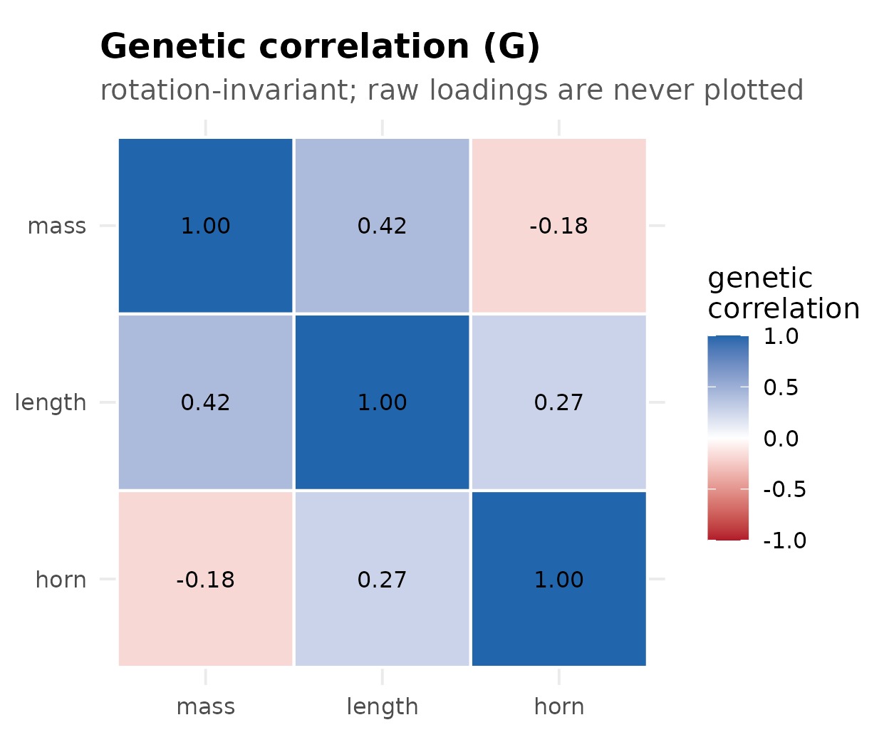
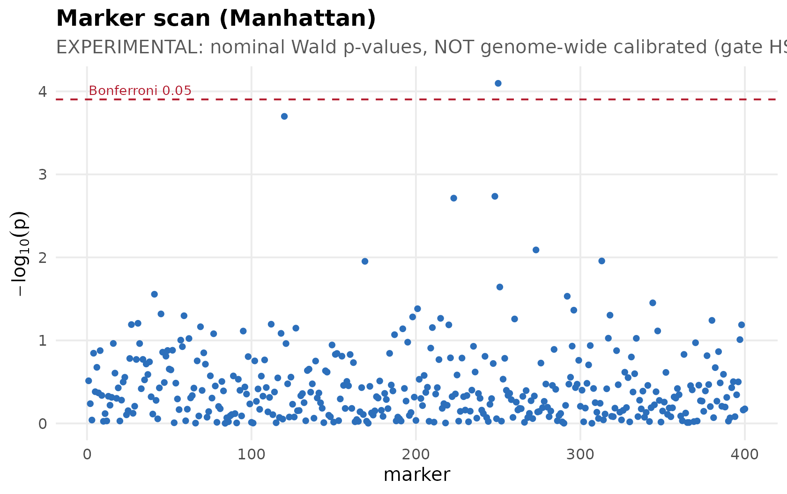

# Visualizing an animal model

`hsquared` ships a small `ggplot2` visualization layer in the style of
the `brms`/`bayesplot` ecosystem (and consistent with the sister
packages `drmTMB` and `gllvmTMB`). Every figure is produced by an
[`autoplot()`](https://ggplot2.tidyverse.org/reference/autoplot.html)
method, returns a `ggplot` object you can theme and extend, and is
**uncertainty-first**: where the fit carries the experimental standard
errors, reliabilities, or prediction error variances, the figure shows
them — clearly labelled experimental and asymptotic.

In your own analysis, `fit` is the object returned by
[`hsquared()`](https://itchyshin.github.io/hsquared/reference/hsquared.md):

``` r

fit <- hsquared(
  weight ~ sex + animal(1 | id, pedigree = ped),
  data = dat, family = gaussian(), REML = TRUE
)
autoplot(fit, "variance")
```

The figures below are rendered from **small illustrative fit objects**
so the article is self-contained (no engine required to build the page);
the
[`autoplot()`](https://ggplot2.tidyverse.org/reference/autoplot.html)
calls are exactly what you would run on a real fit.

## Variance components and heritability

`autoplot(fit, "variance")` draws a horizontal forest of the variance
components and per-trait `h²`, with approximate 95% intervals
(`± 1.96 · SE`) when the fit carries the experimental standard errors.

``` r

autoplot(fit, "variance")
```



## Breeding values

`autoplot(fit, "breeding_values")` draws the sorted estimated breeding
values as a caterpillar, with `± 1.96 · √PEV` bands when prediction
error variances are available (faceted by trait for multivariate fits).

``` r

autoplot(fit, "breeding_values")
```



## Genetic correlation (G)

`autoplot(fit, "g_matrix")` draws the genetic-correlation matrix of an
opt-in multivariate fit. It is **rotation-invariant** — correlations do
not depend on the factor rotation — so it is well defined for any
multivariate fit; raw factor loadings are never plotted (the ratified
cross-lane convention).

``` r

autoplot(fit_mv, "g_matrix")
```



## Marker scan (Manhattan)

[`autoplot()`](https://ggplot2.tidyverse.org/reference/autoplot.html) on
the result of `gwas(fit, markers)` draws a Manhattan plot. The p-values
are **nominal Wald p-values and are not genome-wide calibrated** — the
figure carries that banner, and the dashed line is a plain Bonferroni
reference, not a validated genome-wide threshold.

``` r

autoplot(gw)
```



## Known-truth recovery studies

[`hs_recovery_forest()`](https://itchyshin.github.io/hsquared/reference/hs_recovery_forest.md)
visualizes a known-truth recovery study (such as
`data-raw/multivariate-recovery-study.R`): each target’s bias with its
`± 2 · MCSE` interval. Intervals that cover zero indicate **no
detectable bias**.

``` r

recovery <- data.frame(
  target = c("G0[1,1]", "G0[2,1]", "G0[2,2]", "R0[1,1]", "R0[2,1]",
             "R0[2,2]", "rg", "h2[1]", "h2[2]"),
  bias = c(-0.00395, 0.00621, -0.01459, 0.01171, -0.01223, -0.00106,
           0.01652, -0.00756, -0.00676),
  mcse = c(0.02221, 0.01397, 0.01726, 0.01387, 0.01164, 0.01199,
           0.01553, 0.00817, 0.00697)
)
hs_recovery_forest(recovery)
```


## Theming

Every figure returns a `ggplot` object, so you can restyle it with the
usual `ggplot2` grammar, and
[`theme_hsquared()`](https://itchyshin.github.io/hsquared/reference/theme_hsquared.md)
is exported for reuse:

``` r

autoplot(fit, "variance") +
  ggplot2::labs(title = "My trait") +
  theme_hsquared(base_size = 14)
```
